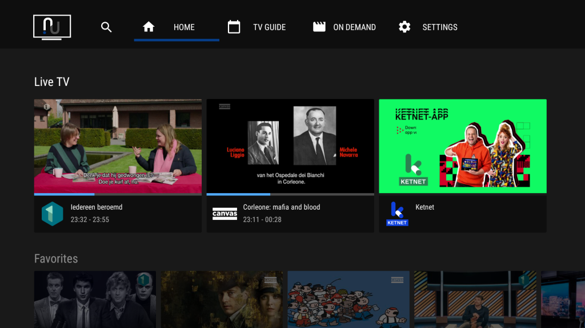
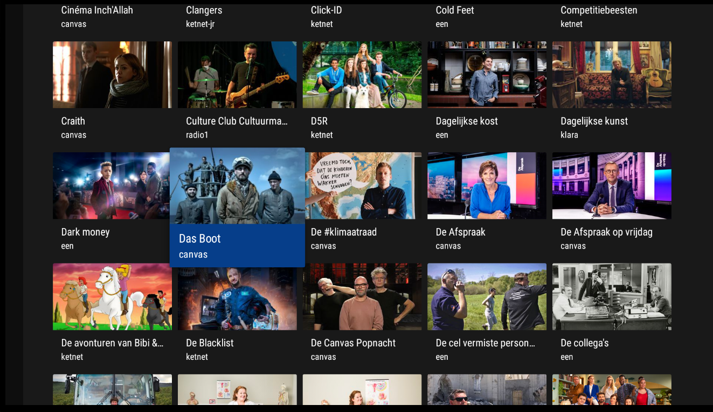
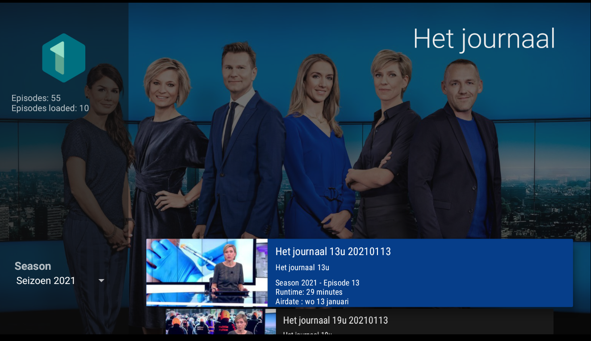
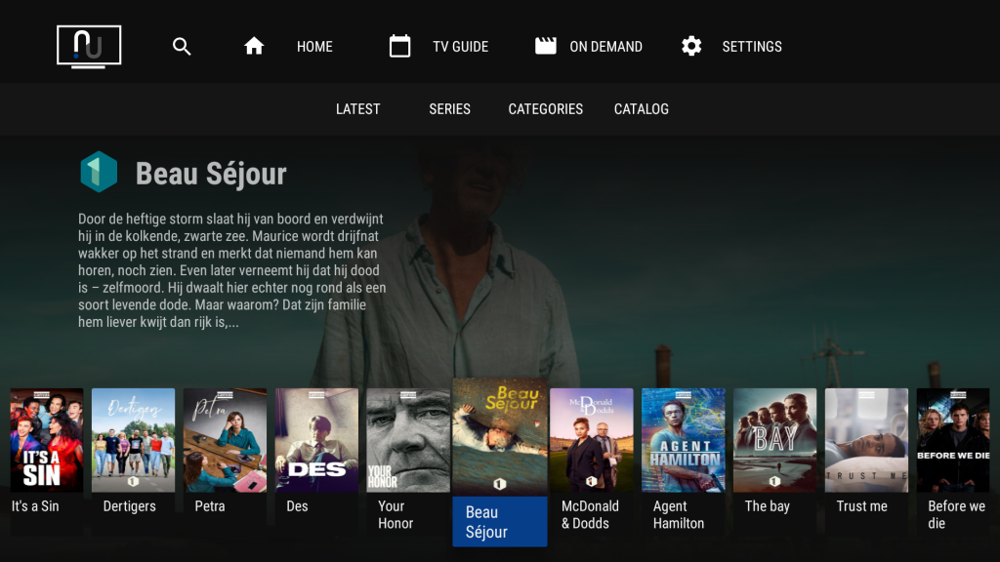

# NUPlayer

This project hosts NUPlayer. An, unofficial, Android TV / Google TV player for VRT.NU content based on the [Leanback library](https://github.com/android/tv-samples) by Google.

Without the great and awesome work of the guys who wrote the [Kodi VRT.NU plugin](https://github.com/add-ons/plugin.video.vrt.nu/) this project would never have existed.

You can install the latest version via Google Play, see [Installation](#installation).

There might be some bugs left here and there, please do open an issue if you spot one.

For now only tested on Google 2020 Chromecast (the one with remote) and TADAAM TV Box. Any (other) recent Android TV box (Mi Box, NVIDIA Shield etc) should work.

# Current status

## Implemented

- VRT login
- Live TV
- TV Guide
- Browsing the VRT.NU catalog
- Playback of any on-demand program in the catalog
- Latest episode listing
- Series listing
- Resume points
- Favorites
- Watch later

## Not (yet) implemented / known limitations / known bugs

- TV Guide doesn't always navigate properly
- Sort order of "Het Journaal" is wrong
- The app might crash in rare cases, mostly when navigating too fast
- Categories is not implemented (no plans to implement, yet)
- The search can be voice controlled but is rather useless in English
- EPG data is not updated when Live TV stream switches program
- A lof of info is not displayed (Description, Geo-location availability, Age restrictions, Genre, etc etc)

# Installation

NUPlayer is available on [Google Play](https://play.google.com/store/apps/details?id=be.lorang.nuplayer).

Install it via the link above on your target device or search for it on your TV via Apps > Search for apps.

# Release history

See [Changelog](CHANGELOG.md)

# Screenshots

<table>
    <tr>
        <th>Home</th>
        <th>Catalog</th>
    </tr>
    <tr>
        <td></td>
        <td></td>
    </tr>
</table>

<table>
    <tr>
        <th>Program detail</th>
        <th>Series</th>
    </tr>
    <tr>
        <td></td>
        <td></td>
    </tr>
</table>